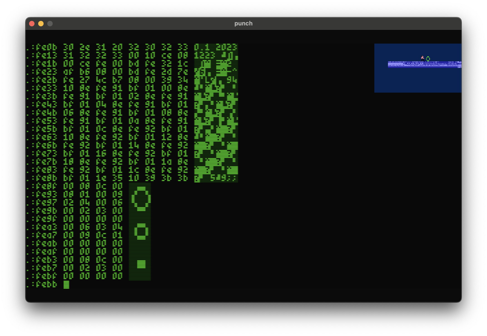

# punch


## Screenshots

Screenshot with scanlines.



## Memory Map

### Addressable by Blitter & MC6809

* ```$00000-$000ff``` direct page (after reset)
* ```$00100-$003ff``` available ram and system stack pointer (768 bytes)
* ```$00400-$00fff``` io
* ```$01000-$0fdff``` 60kb ram (minus 512 bytes)
* ```$0fe00-$0ffff``` 512 bytes kernel + vectors

### Addressable by Blitter only

* ```$10000-$dffff``` available vram (832kb)
* ```$e0000-$fffff``` framebuffer vram (128kb)
