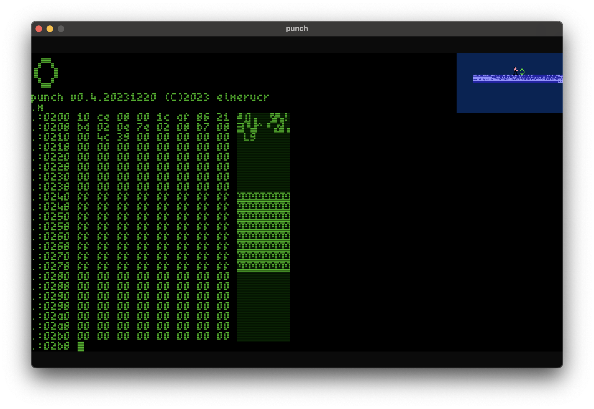

# punch


## Screenshots

Screenshot with scanlines.



## Memory Map

### Addressable by Blitter & MC6809

* ```$00000-$000ff``` direct page (after reset)
* ```$00100-$007ff``` available ram and stack pointer (768 bytes)
* ```$00800-$00fff``` io
* ```$01000-$0ffef``` 60kb ram (minus 16 bytes)

### Addressable by Blitter only

* ```$10000-$11fff``` pixel font 4x6 (8kb)
* ```$11800-$11fff``` available ram (2kb)
* ```$12000-$15fff``` cbm font 8x8 (16kb)
* ```$16000-$dffff``` any video data (808kb)
* ```$e0000-$fffff``` framebuffer (128kb)
