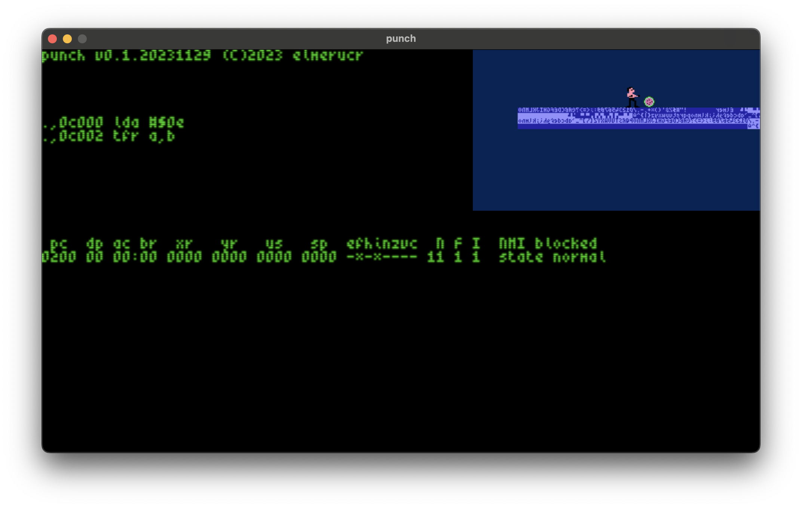

# punch


## Screenshots

Screenshot with scanlines.



## Memory Map

### Addressable by Blitter & MC6809

* ```$00000-$000ff``` direct page (register = $00)
* ```$00100-$003ff``` available ram (768 bytes)
* ```$00400-$0040f``` core registers
* ```$00400-...``` blitter...
* sound
* page into blitter ram?

### Addressable by Blitter only

* ```$10000-$11fff``` pixel font 4x6 (8kb)
* ```$11800-$11fff``` available ram (2kb)
* ```$12000-$15fff``` cbm font 8x8 (16kb)
* ```$16000-$dffff``` any video data (808kb)
* ```$e0000-$fffff``` framebuffer (128kb)
