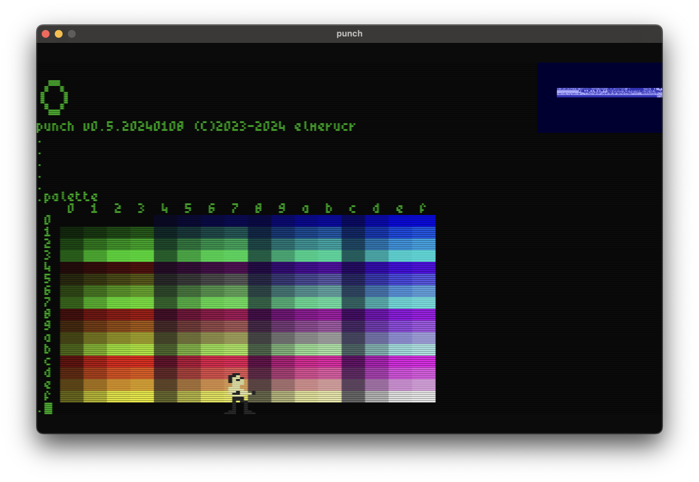

# punch


## Screenshots



## Memory Map

### Addressable by Blitter & MC6809

* ```$000000-$0000ff``` direct page (after reset)
* ```$000100-$0003ff``` available ram and system stack pointer (768 bytes)
* ```$000400-$000fff``` io
* ```$001000-$00fdff``` 60kb ram (minus 512 bytes)
* ```$00fe00-$00ffff``` 512 bytes kernel + vectors

### Addressable by Blitter only

* ```$010000-$0dffff``` available vram (832kb)
* ```$0e0000-$0fffff``` framebuffer vram (128kb)
* ```$100000-$ffffff``` framebuffer vram (15mb)
