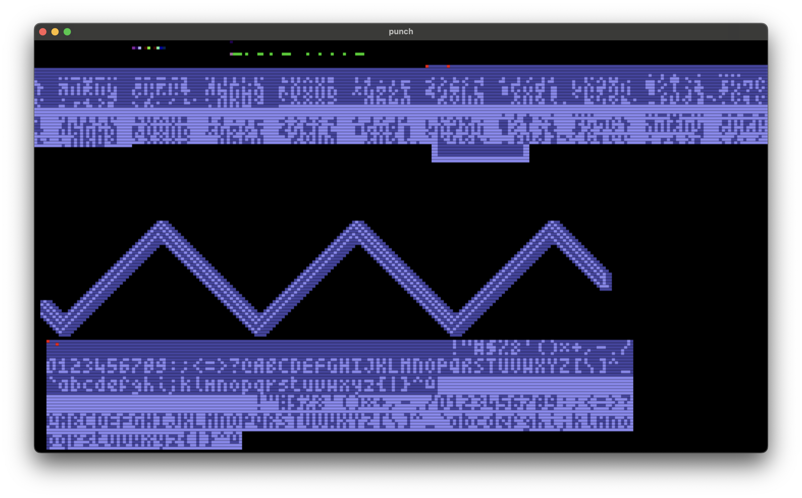

# punch

## Screenshots

Screenshot with scanlines.



## Memory Map

### Addressable by Blitter & MC6809

* ```$00000-$000ff``` direct page

### Addressable by Blitter only

* ```$10000-$dffff``` any video data (832kb)
* ```$e0000-$fffff``` framebuffer (128kb)
