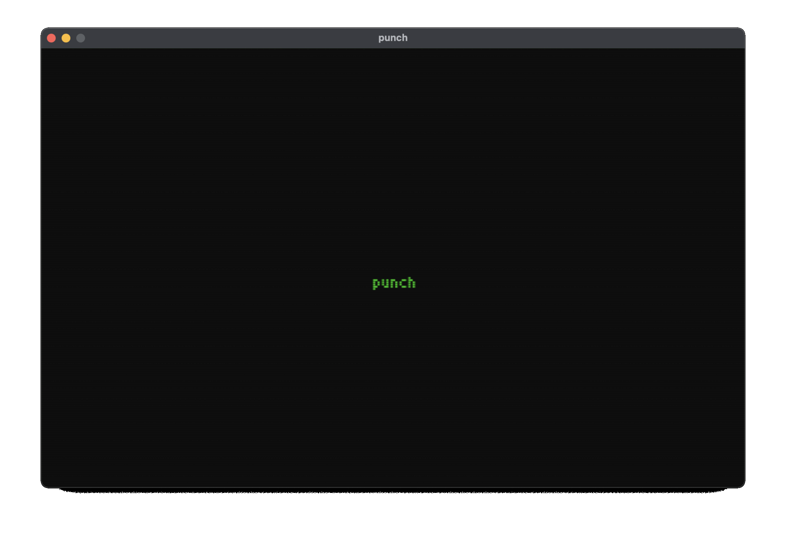
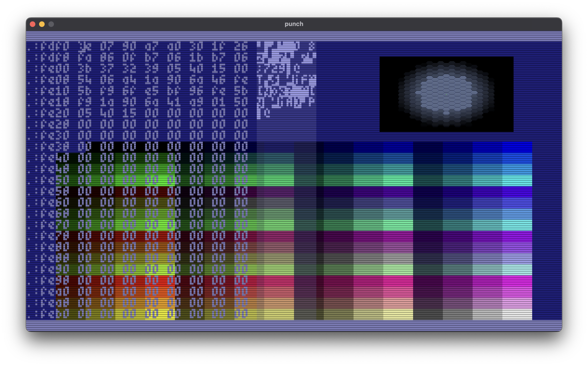

# punch


Punch is a virtual computer system that draws inspiration from iconic computing platforms such as the Commodore 64, Amiga 500, and Atari ST. Notable features include:

* Utilization of the MC6809 CPU using the [MC6809](https://github.com/elmerucr/MC6809) library
* A total of 16MB of video RAM, 64KB directly accessible by the CPU
* Screen resolution of 320x200 pixels, refresh rate of 60Hz
* Blitter chip for fast graphics processing
* Programmable using either MC6809 assembly or the Squirrel Programming Language

## Table of Contents

* [Memory Model](docs/memory.md)
* [Blitter](docs/blitter.md)

## Screenshots

### Startup screen



### Debug screen



## Memory Map

### Addressable by MC6809 and Blitter

*work in progress*

* ```$000-$0ff``` direct page (default after reset)
* ```$100-$3ff``` available ram and system stack pointer (768 bytes)
* ```$0400-$0fff``` input/output area
	* ```$400-$41f``` core
		* ```$800``` status register
		* ```$801``` control register
	* ```$420-$43f``` timer
	* ```$440-$45f``` commander (scripting engine)
	* ```$500-$5ff``` keyboard
		* ```$500``` status register
		* ```$501``` control register (writing only)
		* ```$502/$503``` keyboard repeat delay ms (16 bit unsigned)
		* ```$504/$505``` keyboard repeat speed ms (16 bit unsigned)
		* ```$506``` pop keyboard event (reading only)
		* ```$580-$5ff``` keyboard state
	* ```$600-$7ff``` sound (big endian)
		* ```$600-$61f``` sid 0
		* ```$620-$63f``` sid 1
		* ```$640-$65f``` sid 2
		* ```$660-$67f``` sid 3
		* ```$680-$69f``` sid 0 (all registers readable)
		* ```$6a0-$6bf``` sid 1 (all registers readable)
		* ```$6c0-$6df``` sid 2 (all registers readable)
		* ```$6e0-$6ff``` sid 3 (all registers readable)
		* ```$700-$71f``` analog 0
		* ```$720-$73f``` analog 1
		* ```$740-$75f``` analog 2
		* ```$760-$77f``` analog 3
		* ```$780-$78f``` delays (*wip*)
		* ```$790-$79f``` mixer
		* ```$7a0-$7ff``` *(wip) reserved*	* ```$e00-$eff``` blitter
	* ```$800-$8ff``` blitter base page
		* ```$800``` status register (unused)
		* ```$801``` control register
			* write ```0b00000001```: blit source to destination surface
			* write ```0b00000010```: tile blit source/dest/tile
			* write ```0b00000100```: clear destination surface with drawing color
			* write ```0b00001000```: pset
			* write ```0b00010000```: line
			* write ```0b00100000```: rectangle
			* write ```0b01000000```: solid rectangle
		* ```$802``` source surface pointer (lowest nibble only)
		* ```$803``` destination surface pointer (lowest nibble only)
		* ```$804``` tile surface pointer (lowest nibble)
		* ```$805``` drawing color
		* ```$808-$809``` x0 for drawing operations (16 bit signed)
		* ```$80a-$80b``` y0 for drawing operations (16 bit signed)
		* ```$80c-$80d``` x1 for drawing operations (16 bit signed)
		* ```$80e-$80f``` y1 for drawing operations (16 bit signed)
		* ```$810-$813``` vram peek base address (24 bits, $e10 always #$00)
		* ```$818``` added alpha value during blits
		* ```$819``` added gamma red during blits
		* ```$81a``` added gamma green during blits
		* ```$81b``` added gamma blue during blits
		* ```$81c``` added gamma r, g and b (write only)
	* ```$900-$9ff``` blitter vram poke / peek page (see $810-$813)
	* ```$a00-$aff``` blitter surface descriptors (16 in total, 16 bytes each)
		* ```$ax0-$ax1``` x position (16 bit signed)
		* ```$ax2-$ax3``` y position (16 bit signed)
		* ```$ax4-$ax5``` w width (16 bit unsigned)
		* ```$ax6-$ax7``` h height (16 bit unsigned)
		* ```$ax8-$axb``` base address of surface data ($ax8 will always contain ```$00```)
		* ```$axc``` flags_0
		* ```$axd``` flags_1
		* ```$axe``` flags_2
		* ```$axf``` index ("sprite pointer")
	* ```$b00-$bff``` *reserved*
	* ```$c00-$fff``` color table (32 bits color, 256 values, for 1, 2, 4 and 8 bit modes)
	* ```$1000-$1fff``` color index tables (for 1, 2, 4 and ...)
* ```$2000-$fbff``` 55kb ram ($fc00 is initial usp)
* ```$fc00-$ffff``` 1kb kernel + vectors

### Addressable by Blitter only

* ```$010000-$ffffff``` available vram (16.320kb) of which:
* ```$f00000-$f2d8ff``` default framebuffer vram (182kb)
* ```$f3e800```         draw color, 32 bit, stored in vram *(is this correct)*

## Building with CMake

Create a build directory in the source tree ```mkdir build```, run ```cmake ..``` from that directory and run ```make```. Alternatively do ```mkdir Debug```, run ```cmake -DCMAKE_BUILD_TYPE=Debug ..``` from that directory and run ```make```.

Below some more OS specific intructions on how to prepare the build environment.

### MacOS specific

* Install Xcode from App Store
* When it asks to install command line tools, do that
* Install Homebrew
* From the Homebrew command line, install cmake and SDL2 libraries

### Ubuntu / Debian specific

To be done

### Windows specific

To be done

## Websites and projects of interest

* [CCS64](http://www.ccs64.com) - A Commodore 64 Emulator by Per Håkan Sundell.
* [Commander X16](https://www.commanderx16.com) - The Commander X16 is a modern 8-bit computer currently in active development. It is the brainchild of David "the 8 Bit Guy" Murray.
* [Commander X16 emulator](https://github.com/x16community/x16-emulator) - Software version of Commander X16.
* [freeverb](https://github.com/sinshu/freeverb/) - Free, studio-quality reverb SOURCE CODE in the public domain
* [Hatari](https://hatari.tuxfamily.org) - Hatari is an Atari ST/STE/TT/Falcon emulator.
* [lib65ce02](https://github.com/elmerucr/lib65ce02) - CSG65CE02 emulator written in C.
* [MC6809](https://github.com/elmerucr/mC6809) - MC6809 cpu emulator written in C++.
* [Mega65](http://mega65.org) - The 21st century realization of the C65 heritage.
* [Moira](https://github.com/dirkwhoffmann/Moira) - Motorola 68000 cpu emulator written in C++ by Dirk W. Hoffmann.
* [reSID](http://www.zimmers.net/anonftp/pub/cbm/crossplatform/emulators/resid/index.html) - ReSID is a Commodore 6581 and 8580 Sound Interface Device emulator by Dag Lem.
* [SDL Simple DirectMedia Layer](https://www.libsdl.org) - A cross-platform development library by Sam Lantinga designed to provide low level access to audio, keyboard, mouse, joystick, and graphics hardware.
* [Squirrel](http://squirrel-lang.org) - Squirrel is a high level imperative, object-oriented programming language, designed to be a light-weight scripting language that fits in the size, memory bandwidth, and real-time requirements of applications like video games.
* [stb](https://github.com/nothings/stb) - single-file public domain (or MIT licensed) libraries for C/C++
* [TIC-80](https://tic80.com) - TIC-80 is a free and open source fantasy computer for making, playing and sharing tiny games.
* [vAmiga](https://dirkwhoffmann.github.io/vAmiga/) - An Amiga 500, 1000, or 2000 on your Apple Macintosh by Dirk W. Hoffmann.
* [vasm](http://sun.hasenbraten.de/vasm/) - A portable and retargetable assembler.
* [VICE](http://vice-emu.sourceforge.net) - The Versatile Commodore Emulator.
* [VirtualC64](https://dirkwhoffmann.github.io/virtualc64/) - A Commodore 64 on your Apple Macintosh by Dirk W. Hoffmann.
* [visual6502](http://www.visual6502.org) - Visual Transistor-level Simulation of the 6502 CPU and other chips.

## MIT License

Copyright (c) 2023-2024 elmerucr

Permission is hereby granted, free of charge, to any person obtaining a copy of this software and associated documentation files (the "Software"), to deal in the Software without restriction, including without limitation the rights to use, copy, modify, merge, publish, distribute, sublicense, and/or sell copies of the Software, and to permit persons to whom the Software is furnished to do so, subject to the following conditions:

The above copyright notice and this permission notice shall be included in all copies or substantial portions of the Software.

THE SOFTWARE IS PROVIDED "AS IS", WITHOUT WARRANTY OF ANY KIND, EXPRESS OR IMPLIED, INCLUDING BUT NOT LIMITED TO THE WARRANTIES OF MERCHANTABILITY, FITNESS FOR A PARTICULAR PURPOSE AND NONINFRINGEMENT. IN NO EVENT SHALL THE AUTHORS OR COPYRIGHT HOLDERS BE LIABLE FOR ANY CLAIM, DAMAGES OR OTHER LIABILITY, WHETHER IN AN ACTION OF CONTRACT, TORT OR OTHERWISE, ARISING FROM, OUT OF OR IN CONNECTION WITH THE SOFTWARE OR THE USE OR OTHER DEALINGS IN THE
SOFTWARE.
